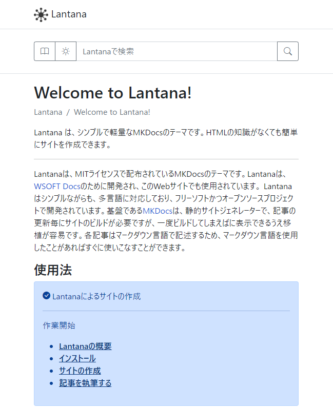

  

<h3 align="center">Lantana</h3>

|Japanese|[English](./README.md)|
|--------|-------|

Lantanaは、Bootstrapを使用した軽量なMkDocsのテーマです。
LantanaとMkDocsを使用すると、簡単に自分のサイトを作成できます。

チュートリアルと詳細な使用方法については、[Lantanaのドキュメント](https://lantana.wsoft.ws/)を参照してください。

## サポート
Lantanaの使用に際してサポートが必要な場合は、お気軽にお問合せください。

- 些細な質問でも、お気軽にGitHubの[Discussions](https://github.com/WSOFT-Project/lantana/discussions)に投稿してください！
- 不具合を報告したり、新機能をリクエストするには、GitHubで[Issue](https://github.com/WSOFT-Project/lantana/issues)を開いてください。

## Lantanaへの貢献
Lantanaプロジェクトは、世界中の開発者やユーザーからの貢献を歓迎しています。
どのように貢献できるかを知るには、[コントリビュートガイド](https://lantana.wsoft.ws/contribute/)

## スクリーンショット

**PC**

**モバイル**

