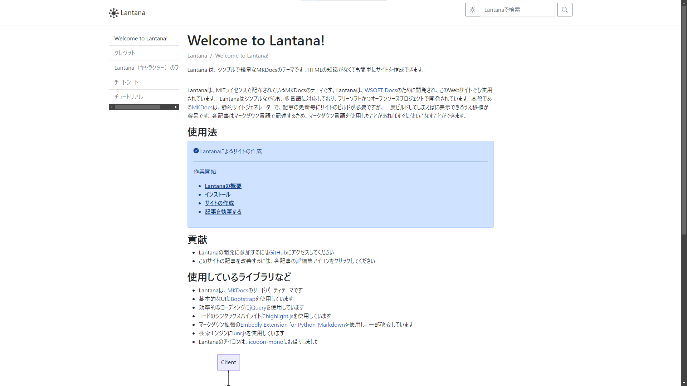
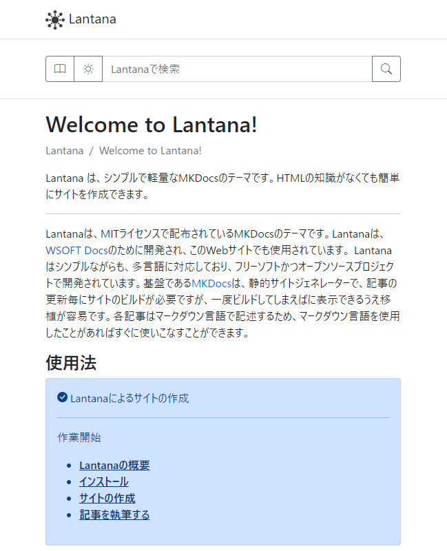

  

<h3 align="center">Lantana</h3>

|[Japanese](./README.ja.md)|English|
|--------|-------|

Lantana is a lightweight MkDocs theme using Bootstrap.
With Lantana and MkDocs, you can easily create your own site.

See [Lantana's Documentation](https://lantana.wsoft.ws/en/) for a tutorial and detailed usage instructions.

## Support
If you need assistance in using Lantana, please feel free to contact us.

- Please feel free to post any questions, even minor ones, to [Discussions](https://github.com/WSOFT-Project/lantana/discussions) on GitHub!
- To report a bug or request a new feature, open [Issue](https://github.com/WSOFT-Project/lantana/issues) on GitHub.

## Contribute
The Lantana project welcomes contributions from developers and users worldwide.
To learn how you can contribute, please visit [Contribute Guide](https://lantana.wsoft.ws/contribute/)

## Screenshots

**PC**

**Mobile**

